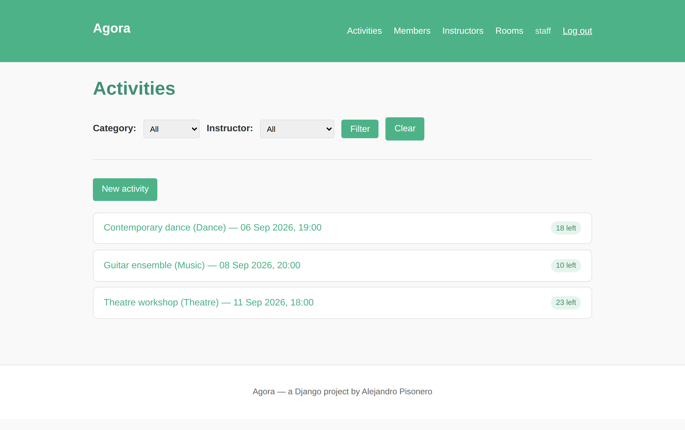
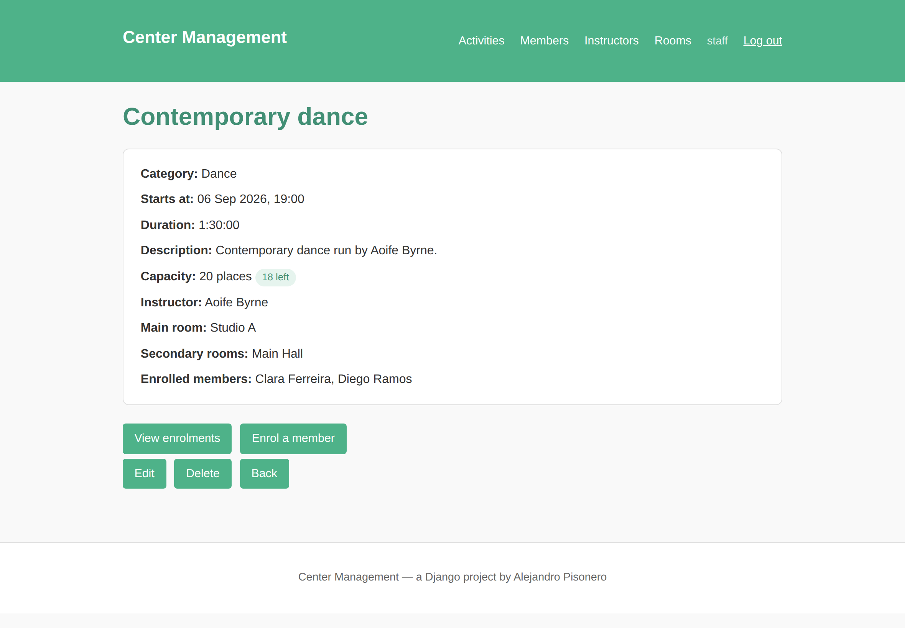
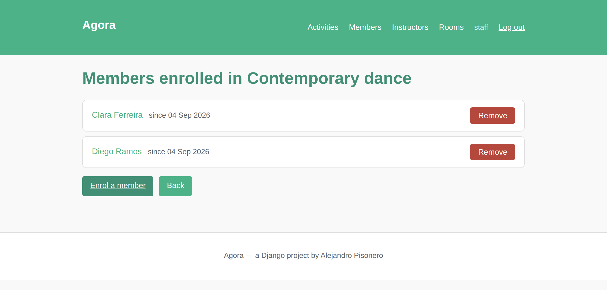

# Center Management

[](https://github.com/Pisonero22/Center-Management/actions/workflows/tests.yml)

A Django application for running a cultural centre: schedule activities, assign
instructors and rooms, register members and keep track of who is enrolled in what.

It started as my final university project and I have since rewritten it as a
portfolio piece — English codebase, environment-based configuration, an explicit
domain model and a documented setup.

## Features

- CRUD for the four entities of the domain: **activities**, **members**,
  **instructors** and **rooms**.
- **Enrolments** modelled as an explicit join table, so the enrolment date is
  recorded and a member cannot be enrolled twice in the same activity.
- Server-side **filtering**: activities by category and instructor, members by
  the activity they attend.
- **Django admin** configured with list displays, filters, search and an inline
  for the enrolments of an activity.
- A **`seed_demo`** management command that fills the database with a small
  demo dataset in one line.
- **Authentication**: the catalogue is public, but creating, editing, deleting
  and enrolling require a signed-in user.
- **Capacity is enforced**: an activity refuses enrolments once it is full, and
  it cannot offer more places than its main room holds.
- **Paginated lists** that keep the active filters in the page links, and
  querysets that load their related objects up front instead of one row at a
  time.

## Screenshots

| Activity list | Activity detail |
| --- | --- |
|  |  |



## Data model

```mermaid
erDiagram
    INSTRUCTOR ||--o{ ACTIVITY : "teaches"
    INSTRUCTOR ||--o{ ROOM : "manages"
    ROOM ||--o{ ACTIVITY : "hosts as main room"
    ROOM }o--o{ ACTIVITY : "hosts as secondary room"
    MEMBER ||--o{ ENROLLMENT : "signs up"
    ACTIVITY ||--o{ ENROLLMENT : "receives"

    MEMBER {
        string full_name
        string email UK
        string phone
    }
    INSTRUCTOR {
        string full_name
        string specialty
    }
    ROOM {
        string name
        int capacity
        string location
        fk manager "Instructor, nullable"
    }
    ACTIVITY {
        string name
        string category "choices"
        datetime starts_at
        duration duration
        int capacity
    }
    ENROLLMENT {
        fk member
        fk activity
        datetime created_at
    }
```

`Enrollment` is the `through` model of the many-to-many between `Member` and
`Activity`. A `UniqueConstraint` on `(member, activity)` enforces at database
level that the same person cannot take two places in one activity.

## Stack

| Layer      | Choice                                            |
| ---------- | ------------------------------------------------- |
| Language   | Python 3.12                                       |
| Framework  | Django 5.2 (class-based views, ORM, admin)        |
| Database   | SQLite in development                             |
| Frontend   | Django templates with a hand-written stylesheet   |
| Config     | Environment variables loaded from a `.env` file   |

## Getting started

```bash
git clone https://github.com/Pisonero22/Center-Management.git
cd Center-Management

make demo         # virtualenv, dependencies, .env, migrations and sample data
make superuser    # an account to sign in with
make run          # http://127.0.0.1:8000/
```

`make demo` runs [`scripts/setup.sh`](scripts/setup.sh), which creates the
virtualenv, installs the dependencies, writes a `.env` with a freshly generated
secret key and applies the migrations. `make help` lists the rest
(`make test`, `make check`, `make clean`).

Without `make`, the same by hand:

```bash
python3 -m venv .venv
source .venv/bin/activate          # Windows: .venv\Scripts\activate
pip install -r requirements.txt
cp .env.example .env               # then set DJANGO_SECRET_KEY
python manage.py migrate
python manage.py seed_demo         # optional: demo data
python manage.py createsuperuser   # no accounts ship with the project
python manage.py runserver
```

There are no default credentials: browsing is public and the account you create
with `createsuperuser` is the one that can write and reach `/admin/`.

## Configuration

| Variable               | Default                 | Purpose                                    |
| ---------------------- | ----------------------- | ------------------------------------------ |
| `DJANGO_SECRET_KEY`    | insecure development key | Signing key. Required when debug is off.   |
| `DJANGO_DEBUG`         | `true`                  | Debug mode. Set to `false` in production.  |
| `DJANGO_ALLOWED_HOSTS` | `localhost,127.0.0.1`   | Comma-separated list of accepted hosts.    |

No secret is committed to the repository: `settings.py` reads these from the
environment and refuses to start with the development key when debug is off.

## Tests

```bash
make test          # or: python manage.py test
```

Every push and pull request runs the same suite on GitHub Actions
([`.github/workflows/tests.yml`](.github/workflows/tests.yml)).

Twenty tests, no extra dependencies, covering the parts that can actually break:

| Area          | What is checked                                                        |
| ------------- | ---------------------------------------------------------------------- |
| Models        | Uniqueness of an enrolment, capacity arithmetic, room-size validation   |
| Permissions   | Every write view redirects an anonymous visitor to the login page       |
| Enrolments    | Duplicates, a full activity, and removal only through POST              |
| Filters       | Activities by category and instructor, members by activity              |
| Efficiency    | The activity list runs three queries regardless of how many rows it has |

## Project layout

```
center-management/
├── config/              # project settings, root URLconf, WSGI/ASGI entry points
├── activities/          # the single application
│   ├── models.py        # Member, Instructor, Room, Activity, Enrollment
│   ├── views.py         # class-based CRUD + the enrolment flow
│   ├── forms.py         # model forms
│   ├── admin.py         # admin configuration
│   ├── urls.py          # application routes
│   ├── management/      # seed_demo command
│   ├── tests/           # model and view tests
│   ├── static/css/      # stylesheet
│   └── templates/       # base layout and one folder per entity
├── scripts/setup.sh     # one-command environment setup
├── Makefile             # setup, run, test, check, superuser, clean
├── .github/workflows/   # CI: system checks and tests on every push
├── manage.py
└── requirements.txt
```

## Design notes

- **Class-based views for the CRUD, function views for the enrolment flow.**
  The CRUD is repetitive and generic views remove that boilerplate; enrolling
  someone has actual rules, and a plain function keeps them readable.
- **Destructive actions go through POST.** Removing an enrolment is a form with
  a CSRF token, not a link — a GET request should never change state.
- **The database enforces the invariants it can.** Uniqueness of an enrolment is
  a constraint, not only a check in the view.
- **The last place is a race.** Counting the enrolments and inserting the new
  one happen inside a single transaction with a row lock, so two people
  clicking at the same time cannot both take the last place.
- **Listing activities costs three queries, not one per row.** The list view
  annotates the enrolment count and the model reuses that annotation when it
  is there, so `places_left` does not turn into an N+1.
- **Read is public, write is authenticated.** A visitor can browse the
  programme; only signed-in staff change it. Logging out is a POST form, as
  Django requires since 4.1.

## Roadmap

- [ ] Docker Compose setup with PostgreSQL.
- [ ] REST API with Django REST Framework.

## Licence

MIT — see [LICENSE](LICENSE).
